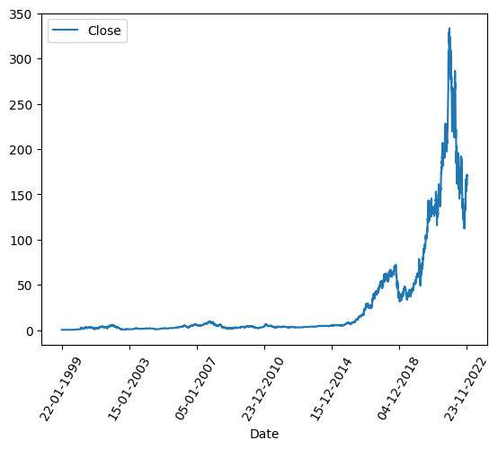
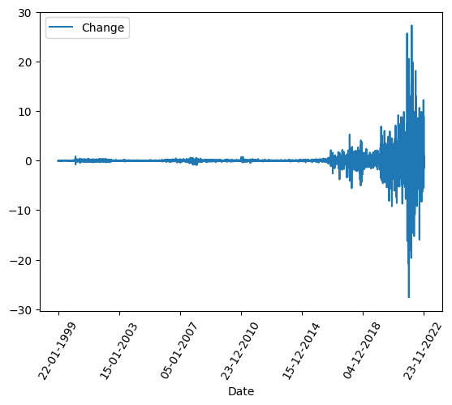
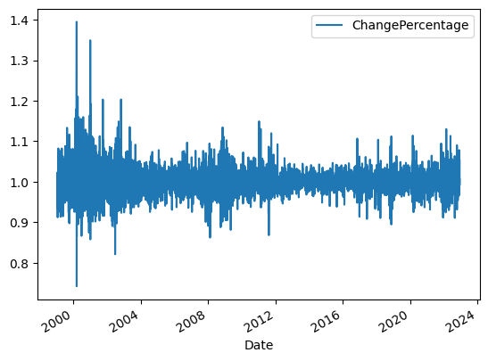
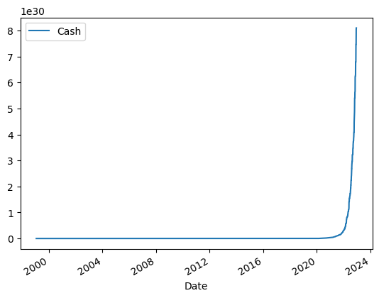

# Optimal Investering

Bakgrunnen for prosjektet mitt er at mange av vennene mine har vært interessert i aksjehandel og *trading* i det siste, og jeg syns det virket interresant. Så etter å ha funnet et datasett som representerte aksjeverdien til NVIDIA over de siste 23 årene bestemte jeg meg for å prøve å svare på spørsmålet: 

# *Hva er det meste jeg kunne tjent på denne aksjen, hvis jeg hadde handlet perfekt i alle de 23 årene?*

Til å begynne med lastet jeg ned NVDA.csv filen fra Kaggle:

**https://www.kaggle.com/datasets/paultimothymooney/stock-market-data**

Og fikk det lastet inn i programmet mitt.

## Verdi

Jeg grafet så *Close* kolonnen mot datoene for å sjekke at dataen var lastet riktig, og det var det. 

## Change

**Change** var den neste kolonnen jeg lagde. Den er kun forskjellen på aksjeverdien mellom når markedet åpnet og når markedet stengte, altså den gjennomsnlittlige verdiendringen ila. en dag, fortsatt uttrykt i valuta.

Det jeg syns var interresant her er at grafen ser relativt symmetrisk ut rundt x-aksen, selv om selve verdi-grafen har en veldig betydelig økning fra start til slutt. *Change* kolonnen blir dermed bare mer uforusigbar og drastisk, uten noen tydelig retning. Dette samsvarer med hvofor aksjehandling ofte er risikofylt og vanskelig, fordi selv på en aksje som NVIDIA er det nesten umulig å se om en aksje har steget eller sunket i verdi kun basert på den gjennomsnittlige endringen.

## Zoom

Jeg lagde så en zoom funksjon for å gjøre det lettere å analysere dataene mine senere.

`def print_last_n_days(int,str)`

Den tar en int, ***days***, som er antall dager før siste dato i datasettet.

Den tar også en str, ***focus***, som er hvilken kolonne som skal bli grafet på y-aksen.

Denne funksjonen gjør det kun lettere å analysere senere, og har ingen betydning for selve problemstillingen.

## ChangePercentage

***ChangePercentage*** er en custom kolonne som bare utrykker *Change* kolonnen i form av en prosent, og ikke valuta.

Det som er interresant med grafen for denne kolonnen er at verdien er enda mer uforutsigbar, og har liten endring i spredning over de 23 årene som dataene gjelder for.

# Optimal Investering

For å beregne den optimale investeringen må det gjøres noen antakelser først:
 - Alle salg/kjøp skjer ved starten av en dag
 - Alle salg/kjøp skjer alltid, uavhengig om det finnes kjøpere/selgere på motsatt ende
 - Svingninger ila. en dag blir ignorert

Så satt jeg opp en ny kolonne, *Cash*, som representerte verdien på den opprinnelige investeringen i forhold til datoen, sammen med en variabel som representerer den opprinnelige investeringen

**Logikken er enkel:**

Koden går gjennom hver dag i hele datasettet, kronologisk. For hver dag bruker den den tidligere definerte *ChangePercentage* kolonnen for å sjekke om en aksje burde selges, kjøpes eller holdes. Er *ChangePercentage* > 1 er verdien for *i dag* gitt ved 

`Cash[i] = Cash[i - 1] x ChangePercentage[i]`

## Resultat

Verdien av den opprinnelige investeringen får en ekstremt drastisk økning, spesielt i løpet av de 2-3 siste årene i datasettet. Dette samsvarer også med den største økningsperioden i verdien til aksjen. 

Hvis den opprinnelige investeringen var 100kr, ville den ved slutten av datasettet vært verdt omtrent:

### 8,000,000,000,000,000,000,000,000,000,000 NOK

Dette resultatet kommer både fra *Pandas* metoden, og den *"manuelle"*

